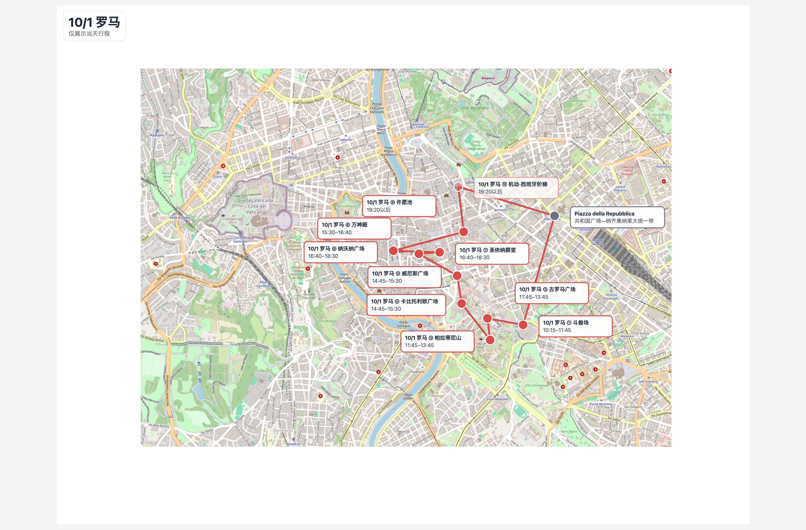
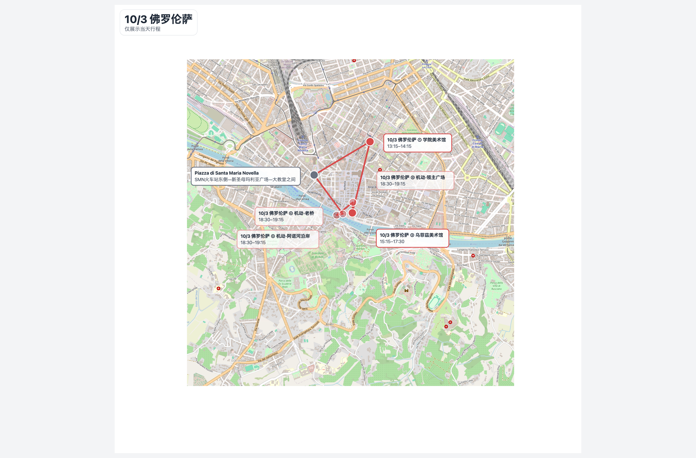
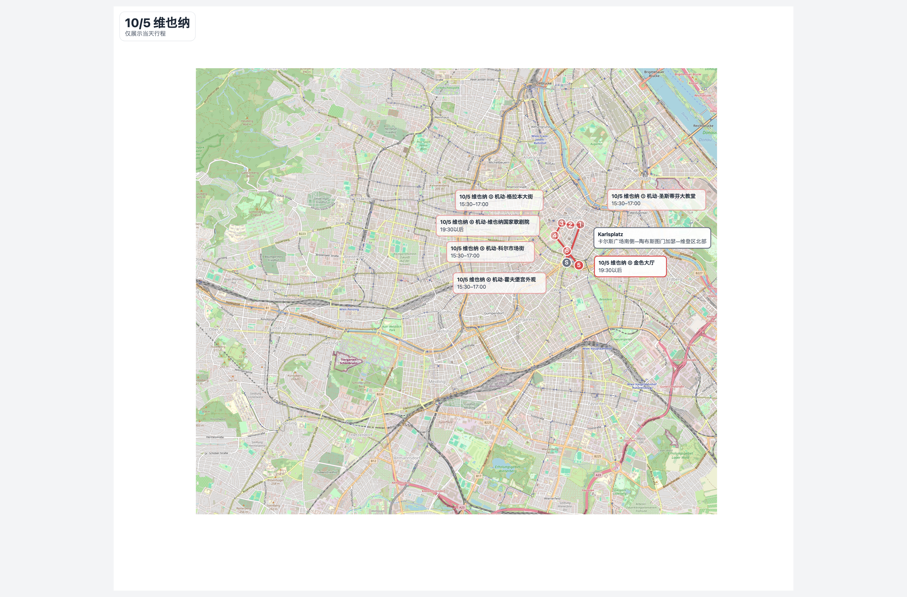

# Travel Itinerary Map Skill

中文版本请见 [README-zh.md](README-zh.md)。

A Codex skill for generating standalone travel itinerary maps on real map tiles.

The renderer geocodes real places, embeds OpenStreetMap tiles, labels stops in visit order, adds visit times, draws per-day route overlays, and outputs a standalone HTML file that can be opened directly in a browser.

## Features

- Real map tiles and real geocoded coordinates.
- Numbered itinerary stops with visit times.
- Circled numerals in stop information boxes, such as `①`, `②`, `③`.
- Distinct per-day route color or line style.
- Optional stops marked as flexible using the same day color with semi-transparent styling.
- Per-legend checkboxes for days, optional stops, and lodging points.
- Routes redraw through the remaining visible stops after filtering optional or lodging points.
- Built-in zoom controls for zooming in, zooming out, and returning to the fitted view.
- Default browser view auto-fits the full map without scrolling.

## Usage

Create an itinerary JSON file using the shape documented in `references/input-format.md`, then run:

```bash
python3 scripts/render_itinerary_map_html.py --input itinerary.json --output-dir outputs
```

The script writes a standalone `.html` file to the output directory.

## Examples

Minimal itinerary input:

```json
{
  "title": "Rome / Vatican itinerary map",
  "subtitle": "2026-10-01 / 2026-10-02",
  "output_basename": "rome_vatican_itinerary_map_2026",
  "zoom": 15,
  "home": {
    "label": "Piazza della Repubblica",
    "query": "Piazza della Repubblica, Rome, Italy",
    "note": "lodging area representative point"
  },
  "days": [
    {
      "day": 1,
      "label": "10/1",
      "points": [
        {
          "seq": 1,
          "name": "Colosseum",
          "query": "Colosseum, Rome, Italy",
          "time": "10:15-11:45"
        }
      ]
    }
  ]
}
```

Day-specific screenshot capture:

```bash
node scripts/screenshot_itinerary_map_html.mjs \
  --url "file:///path/to/rome_vatican_itinerary_map_2026.html?show=day-1&hide=legend,controls&title=Rome%20Day%201&subtitle=Day-specific%20capture" \
  --output outputs/rome_day1.png
```

## Screenshots

Rome / Vatican day 1:



Florence day 3:



Vienna day 5:



## Dependencies

```bash
python3 -m pip install -r requirements.txt
```

The renderer uses Nominatim for geocoding and OpenStreetMap tiles for the base map. Respect the usage policies of both services when generating maps.
